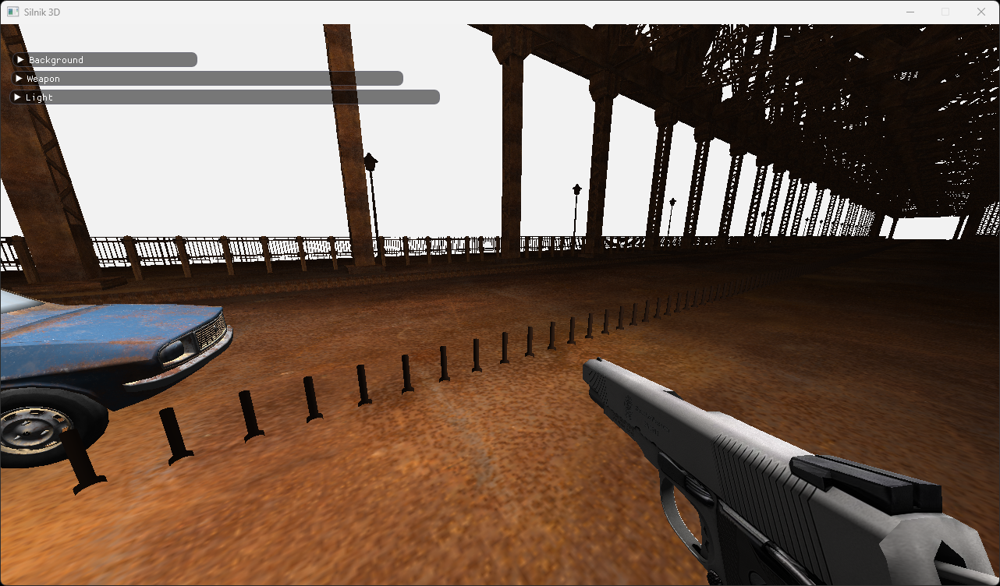
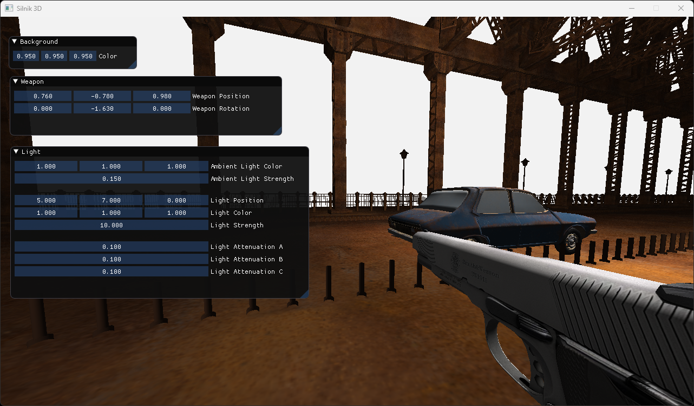

# 3D DirectX Engine
3D game engine made in DirectX 11. It features loading models and textures, modifiable lighting, mouse and keyboard input control, shooting with weapon. Engine developed in 2022.

## Technologies Used
### Languages
- C++
### Libraries
- DirectX11
- DirectXMath - mathematical operations on vectors, matrices
- Assimp - loading 3D models
- DirectXTK - loading textures
- ImGui - GUI

## Example Screenshots
### Engine

### GUI

## Contribution
### Assets
- Bridge - CG-Archion from [cgtrader.com](cgtrader.com)
- Others
